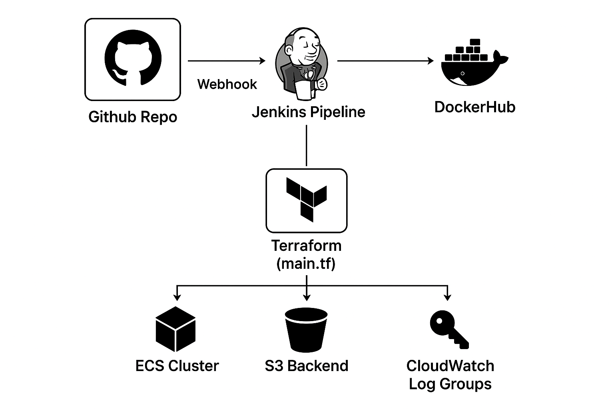

---

# 📘 DevOps Task – CI/CD with Jenkins, Docker, and Terraform

This project demonstrates a CI/CD pipeline using **Jenkins**, **DockerHub**, and **Terraform** for deploying a Node.js application into an **AWS ECS Fargate Cluster**.

---

## 📊 Architecture Diagram




---

## ⚙️ Setup Instructions

### 1. EC2 Setup

* Launch an **EC2 instance** (Amazon Linux 2, default VPC).
* Create a **Security Group** allowing:

  * **22 (SSH)**
  * **80 (HTTP)**
  * **3000 (App)**
  * **8080 (Jenkins)**

### 2. Install Java & Jenkins

```bash
# Install Java 17
sudo amazon-linux-extras enable corretto17
sudo yum install -y java-17-amazon-corretto

# Add Jenkins repo & install Jenkins
sudo wget -O /etc/yum.repos.d/jenkins.repo https://pkg.jenkins.io/redhat-stable/jenkins.repo
sudo rpm --import https://pkg.jenkins.io/redhat-stable/jenkins.io.key
sudo yum install -y jenkins

# Start & enable Jenkins
sudo systemctl start jenkins
sudo systemctl enable jenkins
```

* Add sudo permission for Jenkins user:

  ```bash
  sudo visudo
  jenkins ALL=(ALL) NOPASSWD:ALL
  ```

* Access Jenkins at:

  ```
  http://<EC2_PUBLIC_IP>:8080
  ```

### 3. Jenkins Configuration

* Install plugins: **Git, Docker, Terraform, NodeJS, Pipeline, AWS Credentials**.
* Add credentials:

  * `dockercred` → DockerHub username/password
  * `aws-creds` → AWS Access Key/Secret

### 4. GitHub Repo

Repo (`devops-task1`) contains:

* Node.js application
* **Dockerfile**
* **Terraform configs** (main.tf)

---

## 🔄 Jenkins Pipeline Flow

The pipeline (`devops-task-CICD`) is defined in **Jenkinsfile** with the following stages:

### 1. **Setup Environment**

* Updates system.
* Installs Git, Docker, Terraform, Node.js (via NVM).
* Verifies installations.

### 2. **Clone Repository**

* Removes old repo.
* Clones GitHub repo (`main` branch).

### 3. **Install Dependencies**

* Runs `npm install` for Node.js app.

### 4. **Docker Login**

* Logs in to DockerHub using Jenkins credentials.

### 5. **Build Docker Image**

* Builds Docker image `saihari1/devopstask`.

### 6. **Push Docker Image**

* Pushes image to DockerHub.

### 7. **Terraform Destroy**

* Cleans up old infra before redeploy.

### 8. **Terraform Init**

* Initializes Terraform working directory.

### 9. **Terraform Plan**

* Creates execution plan (`tfplan`).

### 10. **Terraform Apply**

* Applies infra changes: ECS Cluster, ECS Service, IAM Role, S3 backend, Log Group.

---

## 🌐 Terraform Configuration Breakdown

### 1. **Provider**

```hcl
provider "aws" {
  region = "us-east-1"
}
```

Sets AWS region.

### 2. **Backend (S3)**

```hcl
terraform {
  backend "s3" {
    bucket       = "my-rehydration-demo"
    key          = "ecs/prod/terraform.tfstate"
    region       = "us-east-1"
    encrypt      = true
    use_lockfile = true
  }
}
```

Stores Terraform state in S3 (remote backend).

### 3. **CloudWatch Log Group**

```hcl
resource "aws_cloudwatch_log_group" "ecs_logs" {
  name              = "/ecs/devopstask"
  retention_in_days = 7
}
```

Centralized logs for ECS containers.

### 4. **Networking (Default VPC + Subnets)**

```hcl
data "aws_vpc" "default" { default = true }
data "aws_subnets" "default" {
  filter {
    name   = "vpc-id"
    values = [data.aws_vpc.default.id]
  }
}
```

Uses default VPC & subnets.

### 5. **Security Group**

```hcl
resource "aws_security_group" "ecs_sg" {
  ingress { from_port = 3000 to_port = 3000 protocol = "tcp" cidr_blocks = ["0.0.0.0/0"] }
  egress  { from_port = 0 to_port = 0 protocol = "-1" cidr_blocks = ["0.0.0.0/0"] }
}
```

Allows inbound traffic on **3000**, open egress.

### 6. **ECS Cluster**

```hcl
resource "aws_ecs_cluster" "cluster" {
  name = "prod-fargate-cluster"
}
```

Defines ECS Fargate cluster.

### 7. **IAM Role**

```hcl
resource "aws_iam_role" "ecs_task_execution_role" { ... }
resource "aws_iam_role_policy_attachment" "ecs_policy_attach" { ... }
```

Grants ECS tasks permission to pull images and write logs.

### 8. **ECS Task Definition**

```hcl
resource "aws_ecs_task_definition" "task" {
  family = "devopstask-prod"
  container_definitions = jsonencode([{
    name = "app"
    image = "saihari1/devopstask:latest"
    portMappings = [{ containerPort = 3000 }]
    logConfiguration = { awslogs-group = aws_cloudwatch_log_group.ecs_logs.name }
  }])
}
```

Defines how the container runs (image, CPU, memory, port, logging).

### 9. **ECS Service**

```hcl
resource "aws_ecs_service" "service" {
  cluster = aws_ecs_cluster.cluster.id
  task_definition = aws_ecs_task_definition.task.arn
  desired_count = 1
  launch_type = "FARGATE"
  network_configuration {
    subnets = data.aws_subnets.default.ids
    security_groups = [aws_security_group.ecs_sg.id]
    assign_public_ip = true
  }
}
```

Runs ECS tasks as a scalable Fargate service.

---

## ✅ Evaluation Coverage

* **GitHub commits/branching** → Code in `main` branch.
* **Working Jenkins pipeline** → Automates CI/CD.
* **Docker best practices** → Containerized app with image push.
* **Cloud deployment correctness** → ECS Fargate + Terraform infra.
* **IaC bonus** → Terraform for ECS, IAM, S3, CloudWatch.
* **Clarity** → Diagram + setup + pipeline + Terraform explained.

---

