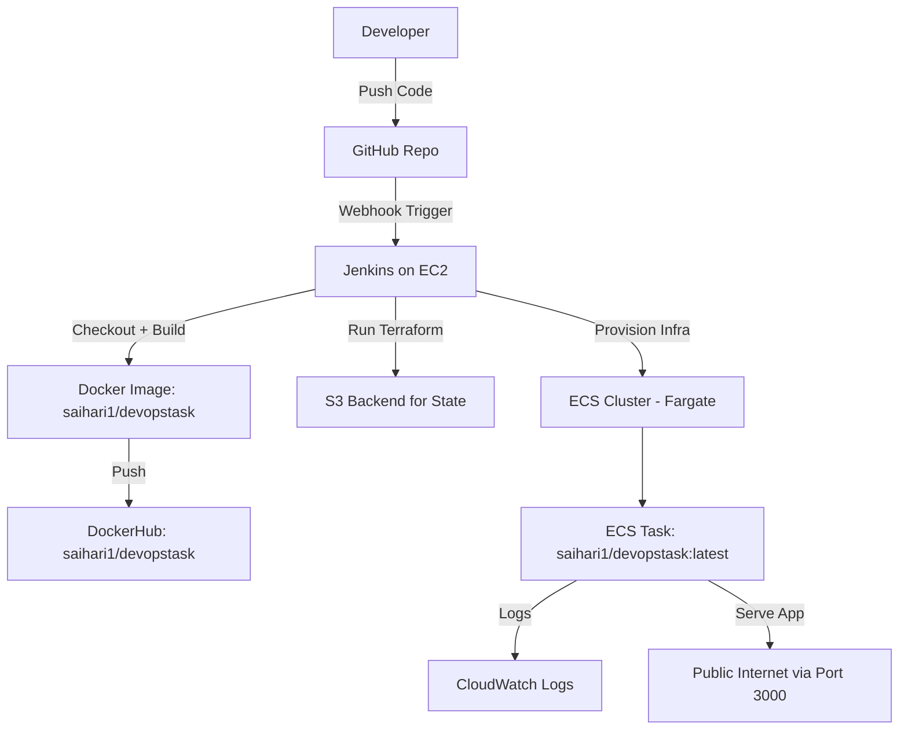

#  README.md for ECS Fargate Deployment with Jenkins + Terraform

##  Project Overview

This project sets up a **CI/CD pipeline** using **Jenkins**, **DockerHub**, and **Terraform** to deploy a containerized application to **AWS ECS Fargate**.

The main flow is:

1. Developer pushes code to **GitHub**.
2. A **Jenkins pipeline (running on EC2)** is triggered via **webhook**.
3. Jenkins builds a **Docker image** and pushes it to **DockerHub** (`saihari1/devopstask`).
4. Jenkins executes **Terraform** scripts that:

   * Create an **ECS Fargate Cluster** and Service.
   * Use **IAM roles** for ECS execution.
   * Store Terraform **state in an S3 backend**.
   * Deploy the Docker image from DockerHub to ECS tasks.
5. Logs are sent to **CloudWatch Logs** for monitoring.

---

##  Infrastructure Components

### AWS Resources Created via Terraform

* **S3 Bucket** → Remote Terraform backend (`my-rehydration-demo`)
* **VPC & Subnets** → Default AWS VPC and subnets
* **Security Group** → Allow inbound traffic on port `3000`
* **CloudWatch Log Group** → `/ecs/devopstask` for ECS logs
* **IAM Role & Policy** → `ecsTaskExecutionRole-prod` with `AmazonECSTaskExecutionRolePolicy`
* **ECS Cluster** → `prod-fargate-cluster`
* **ECS Task Definition** → Runs container `saihari1/devopstask:latest`
* **ECS Service (Fargate)** → `devopstask-prod-service` with public IP

### CI/CD Workflow

* **Jenkins EC2 Server**

  * GitHub Webhook triggers pipeline
  * Pipeline stages:

    * Checkout Code
    * Install Dependencies
    * Build Docker Image → `saihari1/devopstask`
    * Push Docker Image → DockerHub
    * Run Terraform → Deploy on ECS

---

##  Deployment Flow

1. **Developer Pushes Code → GitHub**
2. **Webhook triggers Jenkins pipeline on EC2**
3. **Jenkins builds & pushes Docker image → DockerHub (`saihari1/devopstask`)**
4. **Terraform runs → Deploy ECS Fargate Service**
5. **App running on ECS → Accessible on port 3000**
6. **Logs collected in CloudWatch**

---

##  Architectural Diagram



---

##  Technologies Used

* **AWS ECS Fargate**
* **AWS IAM, VPC, Subnets, CloudWatch**
* **Terraform (with S3 backend)**
* **Jenkins (EC2-based)**
* **Docker & DockerHub (`saihari1/devopstask`)**
* **GitHub SCM with Webhooks**

---

##  How to Run

1. Clone the repository

   ```bash
   git clone <your-repo-url>
   cd repo
   ```
2. Build & push Docker image (via Jenkins)
3. Run Terraform

   ```bash
   terraform init
   terraform plan
   terraform apply
   ```
4. Access app at:

   ```
   http://<ecs-public-ip>:3000
   ```
